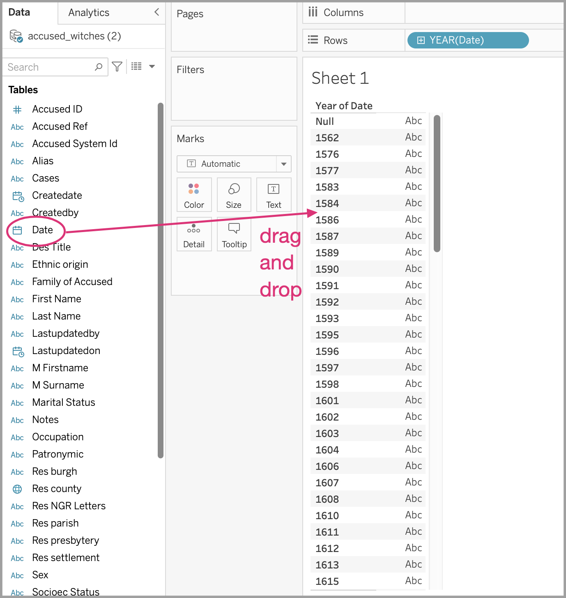

# Tableau: Filters, colors, and more tips and tricks
If you've completed our [first Tableau exercise](https://github.com/miriamposner/get-started-with-tableau/blob/master/getting-started-with-tableau-public.md), or if you already know how to do basic stuff in Tableau, this tutorial will show you how to do a few more interesting things. You'll switch among visualization types, learn how filters work, expose controls to the user, and test your skills on a couple of challenges.

## 1 Welcome (or welcome back)!
[*You can also watch this on video.*](https://share.descript.com/view/KqRXi0Yjjn6)

So you have some experience with Tableau—enough to navigate the user interface and make some basic charts. Let's look at a few of the tool's more advanced features.

For this tutorial, please download [this dataset](https://www.dropbox.com/s/p3xpsd7ubpmg6m5/accused_witches.csv?dl=1). (It comes from the [Survey of Scottish Witchcraft Database](http://witches.shca.ed.ac.uk/)!)

## 2 Import your dataset

Start a new Tableau worksheet (**File** -> **New Worksheet**) and import the witchcraft file as you did in the previous tutorial. Remember, a .csv file is a text file.

[Watch this on video.](https://share.descript.com/view/KqRXi0Yjjn6?t=23.27)

## 3 Correct your data types

Once you've imported the dataset, click on **Sheet** (the orange button at the bottom left of the Tableau window) to be taken to the visualization workspace.

Let's take a look at the fields available to us in Tableau's **Data** pane. As before, we have both measures and dimensions.

Tableau tries to guess what kind of data is in each of your columns, and it does a pretty good job. But I do notice a mistake: it's imported **Date** as a string (a set of characters), not a calendar date. You can tell because the little blue icon to the left of the word "Date" is a tiny "Abc" instead a calendar.

Let's change that. Click on the word **Date** to reveal a dropdown menu. From the menu, choose **Change Data Type**, and then **Date**. The icon next to **Date** should now look like a little calendar.

(You could also click on the "Abc" icon directly to accomplish the same thing.)

[Watch this on video.](https://share.descript.com/view/KqRXi0Yjjn6?t=91.193)

## 4 Get oriented with our data

Let's try to figure out the general contours of our data. My first inclination is to figure out how many people were accused of witchcraft over time.

We want to see a distribution over time, so we know we'll want our chart to include the date. Grab the **Date** field and drop it on the left side of your canvas.

Now you have a list of dates. And if you look above the canvas, you'll see that a "pill" containing YEAR(Date) has appeared on the **Rows** shelf.

[Watch this on video.](https://share.descript.com/view/KqRXi0Yjjn6?t=155.156)

## 5 Add a measure to our chart

We now have a list of dates, but Tableau still doesn't know what you want it to *show* you for those dates.

We want to know the sum of all people accused of witchcraft during those years. Which of our measures could show us that?

We want to use the generated count again: that is, the count of records that Tableau has added to our list of measures. It looks like this: *accused_witches (2).csv (Count)*. Grab that measure and drop it in our table, in the column that's currently populated by rows reading "Abc."

Now, the second column in your table should give you a count of all the records for that year.

[Watch this on video.](https://share.descript.com/view/KqRXi0Yjjn6?t=202.971)

## 6 Our first visualization

It's nice to start out with a simple chart, so click on the **horizontal bar** tile in the **Show me** pane.

That sort of works, in the sense that a bar chart appears, but it's a bit hard to read. Two things bug me: first, it would be easier to understand if the dates appeared on the horizontal axis, and second, there are so many "null" values that they distort the scale of the graph, so that every other year looks similar in comparison.

[Watch this on video.](https://share.descript.com/view/KqRXi0Yjjn6?t=248.22)

## 7 From horizontal to vertical

Let's start by switching the axes of our bar chart, so that the date appears along the bottom.

Luckily, there's a button for that! Find it in Tableau's top toolbar: a series of squares with an arrow indicating a switch.

When you click the button, you'll see that the blue and green pills switch places on the row and column shelves, and your axes reconfigure themselves so that the date runs along the bottom.

Better! But let's get rid of those null values.

[Watch this on video.](https://share.descript.com/view/KqRXi0Yjjn6?t=283.645)

## 8 Filter your dates

To filter out the null values, click on the dropdown arrow on the blue "pill" that reads YEAR(Date) in the** Columns** shelf. From the menu that emerges, click **Filter**.

Now we can see our options for filtering out year values. This is pretty straightforward! Uncheck the **Null** checkbox, then click **OK**.

Now it's a bit easier to see which years saw the most witchcraft accusations.

[Watch this on video.](https://share.descript.com/view/KqRXi0Yjjn6?t=318.589)

## 9 Add another dimension to your chart

It would be nice to see the sex breakdowns of accusations per year. To do that, grab the **Sex** field from the left-hand list and drop on the **Color** tile on the **Marks** pane. (You could also drop it directly on the canvas; you can often do things multiple ways in Tableau.)

Perhaps you'd like to change the default colors on the stacked bar chart that you now see. To do that, you'll want to reveal your **Legend**—right now it's probably covered by the **Show me** pane (the pallet of visualization types at the top right of your window).

To reveal the legend, click on the words **Show me** at the top of the "Show me" pane in order to collapse that menu. You should now see a legend. Double-click on any of the elements to change their assigned colors. (You can bring back the Show me pane by clicking again on its name.)

[Watch this on video.](https://share.descript.com/view/KqRXi0Yjjn6?t=392.754)

## 10 View the data as a highlight table

The bar chart is helpful, but let's try another visualization type for comparison. From the **Show me** pane, select the **highlight table**: it's a grid of green and yellow rectangles.

It's probably easier to see the table if the years run vertically, so use the **Swap rows and columns** button again to change the orientation.

Compare this chart to the bar chart. Does your eye more easily spot the very active years? What are the relative strengths of each type of chart?

(You might like to play with the chart's details, too. If you look at the dropdown menu immediately beneath the title of the **Marks** pane, you'll see that **Square** is selected. What happens if you switch that to **Circle**? What happens if you drag *accused_witches(2).csv (Count)* on to the **Size** button on the **Marks** pane?)

[Watch this on video.](https://share.descript.com/view/KqRXi0Yjjn6?t=453.401)

## 11 See the top 10 years

Go back to the stacked bar chart view of your data. (You can use the "back" arrow button to do this.)

Perhaps it would be useful to see which years saw the most accusations of witchcraft. To do this, we'll use a different kind of filter.

From the blue **YEAR(Date)** pill on the **Columns** shelf, click the dropdown arrow and then select **Filter.** This time, click on the **Top** button. Click the **By field** radio button and set the parameters to Top 10 by Count (as shown). Then click **OK**.

Try filtering by other parameters, too. Can you figure out how to show only those years in which at least 10 people were accused of witchcraft? (You'll need to use the **Condition** pane.)

How can we show the data for only female accused witches? (You'll need to set another filter, this time on **Sex**.)

[Watch this on video.](https://share.descript.com/view/KqRXi0Yjjn6?t=575.141)

## 12 Change the X axis

So far, we've been viewing our data by date. Let's try changing that to county, to see if we notice anything else that strikes our attention.

Drag the **Res county** field to the **Columns** shelf. Remove the **YEAR(Date)** pill by clicking its down arrow and selecting **Remove**.

Now we see the activity by county in the 10 years during which there were the most witchcraft accusations (because, remember, our YEAR(Date) filter is still active; you can remove it if you want).

If you'd like, you can sort the counties in ascending or descending order, using the buttons immediately to the right of the Switch Columns and Rows button.

[Watch this on video.](https://share.descript.com/view/KqRXi0Yjjn6?t=683.432)

## 13 Clear your workspace

Let's try to figure out the ages of people accused of witchcraft over time. 

Start by clearing the "pills" from the columns and rows shelves, the filters pane, and the marks pane, so that your worksheet is blank.

[Watch this on video.](https://share.descript.com/view/KqRXi0Yjjn6?t=763.982)

## 14 Add your dates to the canvas

Since we want to look at ages over time, we know we'll need our **Date** field. Grab that field from the **Tables** list on the left and drop it on the canvas.

[Watch this on video.](https://share.descript.com/view/KqRXi0Yjjn6?t=803.66)

## 15 Add age to your canvas

We want to see how ages change over time, so grab the **Age** field and drop it on the table on your canvas, in the column currently populated by "Abc."

[Watch this on video.](https://share.descript.com/view/KqRXi0Yjjn6?t=813.18)

## 16 A closer look

That seemed to work, but if you scroll down on the table you created, you'll notice some peculiarities. In 1629, for example, you'll see the age 235! In 1630, the age is 270. What's going on?

You can look more closely at the basis of these numbers by clicking on one of these strange values (for example, the "235" value for 1629) and, in the popup that emerges, clicking on the **View Data** icon on the far right. (It looks like three columns of text.)

Then, in the next window, click on the **Full Data** tab. You'll be able to see every value for the year 1629.

Upon closer inspection, it's clear what's happening: Tableau has *added* every age together to get a value of 235 for 1629.

That might make sense if we were working with, say, the costs of goods. But it doesn't make much sense to add up all the ages.

To understand how to get a more meaningful value, let's talk briefly about aggregation in Tableau.

[Watch this on video.](https://share.descript.com/view/KqRXi0Yjjn6?t=829.288)

## 17 Age and aggregation

Tableau always *aggregates* measures for you in some way. For example, it gave us the *sum* of all the records for each year when we created our bar chart showing accustions over time.

Lots of times, "sum" is a good way to aggregate. But sometimes, like now, it doesn't make sense. Let's use a more meaningful form of aggregation.

Click on the **SUM(Age)** pill in the **Marks** pane. From the menu that drops down, select **Measure (Sum)** and then choose a more meaningful form of aggregation, like **Average** or **Median**.

(For more on aggregation, read [here](https://learning.oreilly.com/library/view/practical-tableau/9781491977309/ch08.html#:-:text=An%20Introduction%20to%20Aggregation,using%20the%20Sales%20measure)%3A).)

[Watch this on video.](https://share.descript.com/view/KqRXi0Yjjn6?t=888.343)

## 18 Finish your age chart

Now the numbers make more sense! Let's finish that bar chart.

First, filter out the null values by selecting the **AVG(Age)** pill and making sure the **Include null values** box isn't checked.

Then filter out the null values for the **YEAR(Date)** field.

Convert your table to a bar chart by clicking on the appropriate icon on your **Show me** pane. If you'd like, you can switch the axes so that dates run along the bottom.

Now we have a better sense of the ages of the people accused of witchcraft.

[Watch this on video.](https://share.descript.com/view/KqRXi0Yjjn6?t=946.156)

## 19 Try this

Can you create a chart that displays the sex breakdown of the top 10 occupations of the accused? (See the video for a solution.)

[Watch this on video.](https://share.descript.com/view/KqRXi0Yjjn6?t=990.503)

## 20 Try this

Can you create [sparklines](https://en.wikipedia.org/wiki/Sparkline) showing accusations in the top 10 counties for witchcraft accusations? (You can hide the titles for the axes by right-clicking on them and then unchecking **Show header**.)

([See the video for a solution](https://share.descript.com/view/KqRXi0Yjjn6?t=1124.427).)

## 21 Change the look of your chart

You can customize the look of just about anything on your chart! Right-click (or control-click) on your canvas and select **Format** from the dropdown menu. You'll see that you can switch up your fonts, their layout, color and shading, borders, and many other attributes.

Remember, to change the attributes of the "marks" (the visual representation of your data) on your chart, you'll work with the **Marks** pane or the **Legend**.

## 22 Give the users control

Once you're happy with your final product, let's make it possible for the users to apply filters themselves.

For the **YEAR(Date)** filter, first change the data type from **Discrete** to **Continuous**. This allows the years to be shown as a flowing range of values, rather than individual checkboxes.

Then, select **Show Filter** from the dropdown menu. You'll be able to see a date scrubber next to your chart.

Now, when you publish your chart, your user will be able to change the date range.

From bar charts to filters to user controls, you know how to do a lot with Tableau! If you have some time, [learn about making stories with Tableau.](https://help.tableau.com/current/pro/desktop/en-us/story_create.htm)

[Watch this on video.](https://share.descript.com/view/KqRXi0Yjjn6?t=1285.798)
